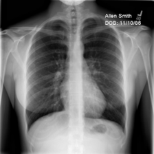
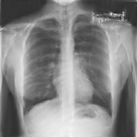

# FL Gradient Inversion

This directory contains the tools necessary to recreate the chest X-ray 
experiments described in 


### Do Gradient Inversion Attacks Make Federated Learning Unsafe? [arXiv:2202.06924](https://arxiv.org/abs/2202.06924)

###### Abstract:

> Federated learning (FL) allows the collaborative training of AI models without needing to share raw data. This capability makes it especially interesting for healthcare applications where patient and data privacy is of utmost concern. However, recent works on the inversion of deep neural networks from model gradients raised concerns about the security of FL in preventing the leakage of training data. In this work, we show that these attacks presented in the literature are impractical in real FL use-cases and provide a new baseline attack that works for more realistic scenarios where the clients' training involves updating the Batch Normalization (BN) statistics. Furthermore, we present new ways to measure and visualize potential data leakage in FL. Our work is a step towards establishing reproducible methods of measuring data leakage in FL and could help determine the optimal tradeoffs between privacy-preserving techniques, such as differential privacy, and model accuracy based on quantifiable metrics.


## Updates

***01/16/2023***

1. Our FL Gradient Inversion [paper](https://arxiv.org/pdf/2202.06924.pdf) is accepted to [IEEE Transactions on Medical Imaging (TMI)](https://www.embs.org/tmi/). 

2. We release the code for FL Gradient Inversion model. 

## Quick-start

First, install requirements. The code was tested with Python 3.10.
```setup
pip install -r requirements.txt
```

To run an example gradient inversion attack from pre-recorded FL gradients 
from a "high-risk" client sending updates in the 10th training round based on 
just image (batch size 1), execute the following.

##### 1. Download the pre-recorded weights.

Download the weights [here](https://drive.google.com/file/d/1o6aZy2oBSD7ayPgkHfZ41lzANhldTVyr/view?usp=share_link)
and extract to `./weights`.

The extracted folder should have the following content.
```
weights
├── batchnorm_round10_client9.npz
├── FL_global_model_round10.pt
└── updates_round10_client9.npz
```

#### 2. Run the inversion code
```
./main.py 
```


## Federated Learning Experiments

To reproduce the experiments in the paper, we use [NVIDIA FLARE](https://github.com/NVIDIA/NVFlare) to produce 
the model updates shared in federated learning. Please visit [here]
(https://nvidia.github.io/NVFlare/research/gradient-inversion) for 
details. 

The expected result is saved under [./outputs/recon.png](./outputs/recon.png). For larger 
training set sizes, several images will be reconstructed. See the 
"local_num_images" config option.

#### Reconstruction

| Original        | Inversion        |
|-----------------|------------------|
|  |  |

> Note, the original image is from the [COVID-19 Radiography Database](https://www.kaggle.com/tawsifurrahman/covid19-radiography-database) (Normal-4085.png), 
> with a random patient name and date of birth overlaid.

## Citation

> A. Hatamizadeh et al., "Do Gradient Inversion Attacks Make Federated Learning Unsafe?," in IEEE Transactions on Medical Imaging, doi: 10.1109/TMI.2023.3239391.

BibTeX
```
@ARTICLE{10025466,
  author={Hatamizadeh, Ali and Yin, Hongxu and Molchanov, Pavlo and Myronenko, Andriy and Li, Wenqi and Dogra, Prerna and Feng, Andrew and Flores, Mona G. and Kautz, Jan and Xu, Daguang and Roth, Holger R.},
  journal={IEEE Transactions on Medical Imaging}, 
  title={Do Gradient Inversion Attacks Make Federated Learning Unsafe?}, 
  year={2023},
  volume={},
  number={},
  pages={1-1},
  doi={10.1109/TMI.2023.3239391}}
```

## License

Copyright (C) 2023 NVIDIA Corporation. All rights reserved.

This work is made available under the Nvidia Source Code License (1-Way Commercial). To view a copy of this license, visit https://github.com/NVlabs/DeepInversion/blob/master/LICENSE
