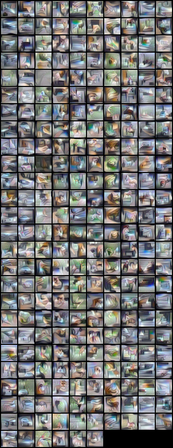

# CIFAR10 experiments

## License

Copyright (C) 2020 NVIDIA Corporation. All rights reserved.

This work is made available under the Nvidia Source Code License (1-Way Commercial). To view a copy of this license, visit https://github.com/NVlabs/DeepInversion/blob/master/LICENSE


## Requirements

Code was tested in virtual environment with Python 3.7. Install requirements:

```setup
pip install torch==1.4.0 torchvision==0.5.0 numpy Pillow
```

Additionally install APEX library for FP16 support (2x less memory and 2x faster): [Installing NVIDIA APEX](https://github.com/NVIDIA/apex#quick-start)

For CIFAR10 we will first need to train a teacher model, for comparison reasons we choose ResNet34 from DAFL method.
Instruction for training teacher model can be found [here](https://github.com/huawei-noah/Data-Efficient-Model-Compression/tree/master/DAFL).
Our model achieves 95.42% top1 accuracy on validation set.

Running inversion with parameters from the paper:
``` 
python deepinversion_cifar10.py --bs=256 --teacher_weights=./checkpoint/teacher_resnet34_only.weights\
 --r_feature_weight=10 --di_lr=0.05 --exp_descr="paper_parameters"
```
 
 Better reconstructed images can be obtained by tuning parameters, for example increasing total variation coefficient: `--di_var_scale=0.001`.
 ``` 
python deepinversion_cifar10.py --bs=256 --teacher_weights=./checkpoint/teacher_resnet34_only.weights\
 --r_feature_weight=10 --di_lr=0.1 --exp_descr="paper_parameters_better" --di_var_scale=0.001 --di_l2_scale=0.0
``` 

